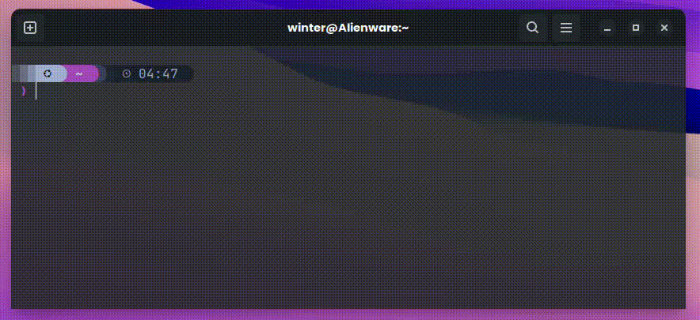

# Currency Generator

## 📖 Desciption


The Currency Converter is a TUI (Text User Interface) application that allows you to select a currency and amount to convert. It can handle multiple currencies at once. The application uses the [Open Exchange Rates](https://openexchangerates.org/) API to fetch currency values and perform conversions and for the interface uses [Huh?](https://github.com/charmbracelet/huh) from [Charm](https://github.com/charmbracelet). Built in Go, the app also allows you to copy the conversion result to your clipboard for easy access.



## 💻 Requirements

- **GoLang**

### Instalation

1 - Clone the repository:

```bash
git clone git@github.com:DilkerWinter/currency-generator.git 
```

2 - Change directory to the project

```bash
cd currency-generator
```

5 - Configure your API KEY on the cmd/service/apiRequest.go to yours

```go
const appID = "Your API Key"
``` 

6 - Build the project

```bash
go build -o currencygenerator main.go
 ```

7 - Now you can run the app

```bash
./currencygenerator
```

if you want to create a command line to use the app

```bash
sudo mv currencygenerator /usr/local/bin/
```

and verify if you have in your ~/.bashrc or ~/.zshrc the following line

```bash
export PATH="/usr/local/bin:$PATH"
```

## 🤖 Languages


